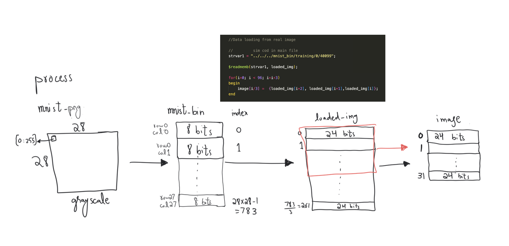
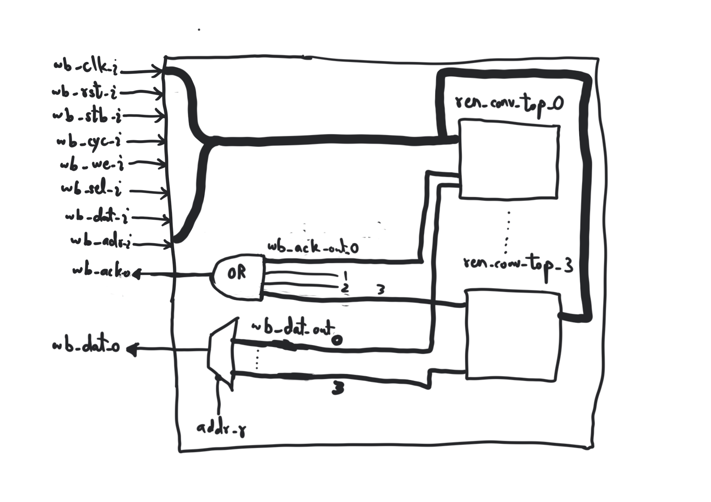
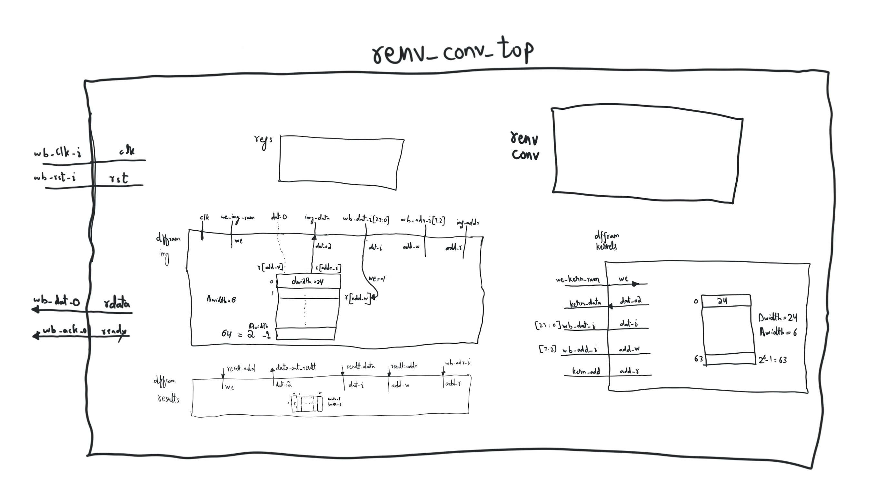
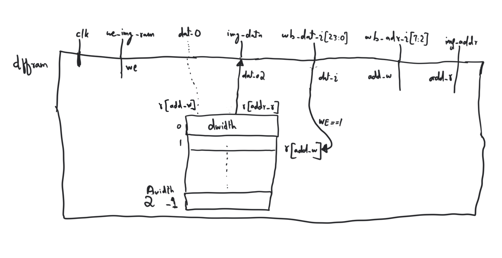
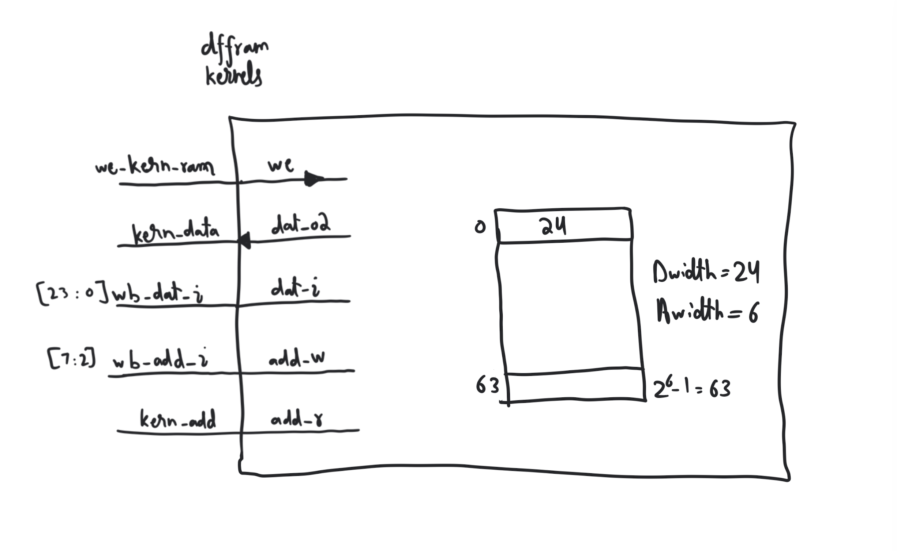
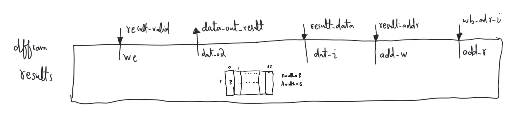
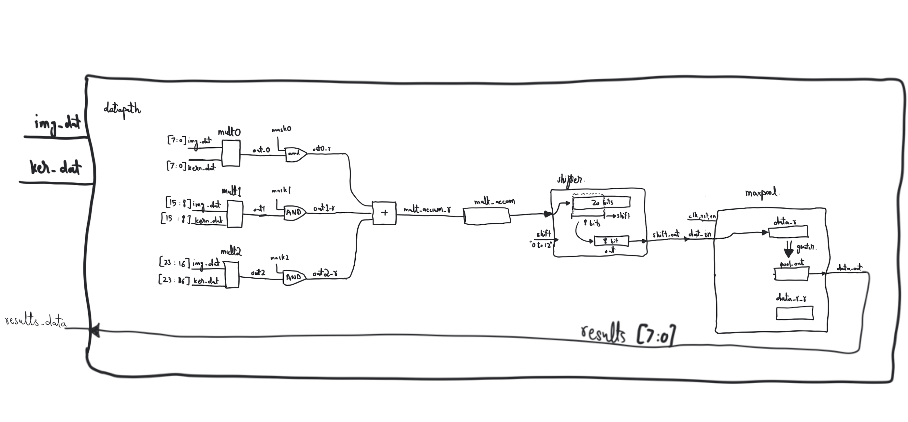
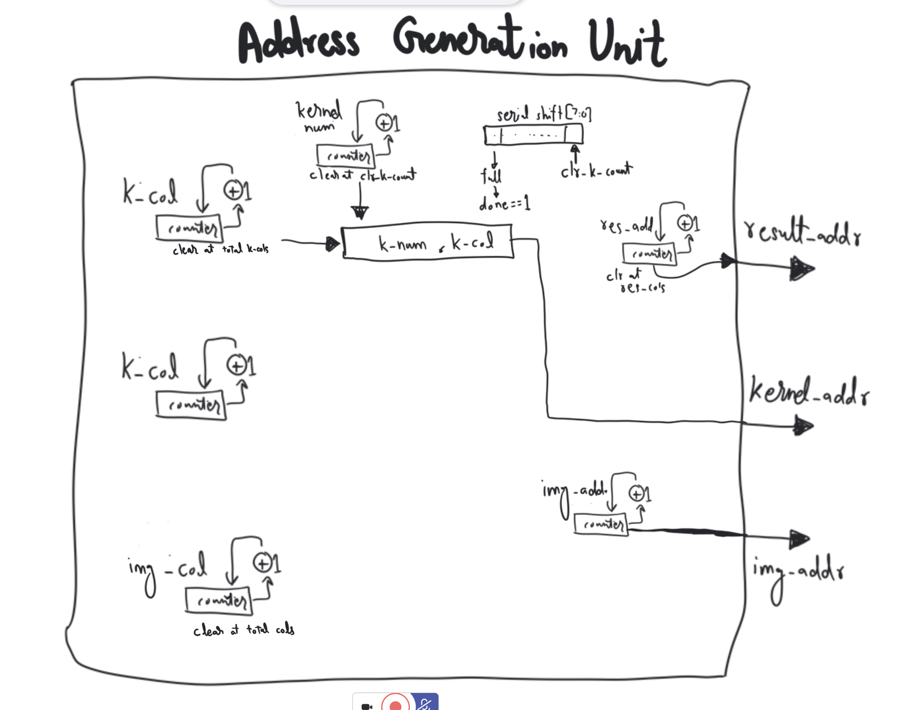

# CNN Design Visuals
## Image Sending Process

## Wrapper Module

## Consists of 4 Conv Top

## Each having 3 DFFRAMS
### Image

### Kernel

### Result

## Along with Datapath

## Generating Addresses using

